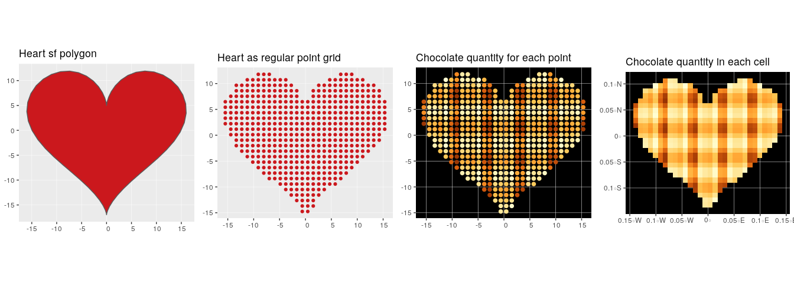
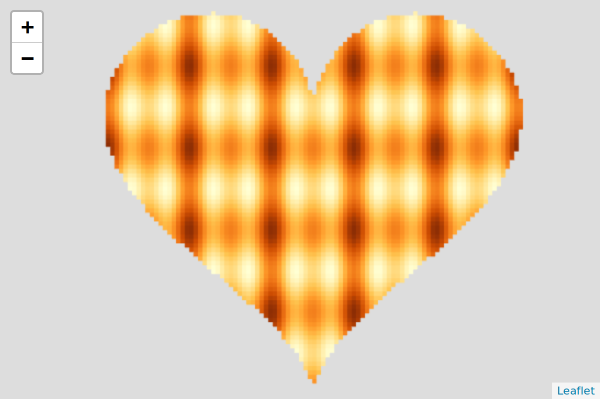

<!-- README.md is generated from README.Rmd. Please edit that file -->
waffler
=======

The goal of waffler is to generate the world largest waffles as interactive spatial grid.

``` r

```


> See the related SatRdays Paris presentation to understand the origin: <https://github.com/statnmap/prez/blob/master/2019-02-22_SatRdays_Paris.pdf>

Installation
------------

You can install the released version of waffler from github with:

``` r
# install.packages("remotes")
remotes::install_github("ThinkR-open/waffler")
```

Example
-------

### Rasters are polygons (waffles too...)

**How to render interactive grid quickly?**

-   Build a heart polygon waffle with {sf}
-   Create regular grid from polygon: `st_sample`
-   Generate more or less chocolate
-   Create polygon grid with correct `crs` to avoid deformation on leaflet

``` r
library(waffler)
library(dplyr)
#> 
#> Attaching package: 'dplyr'
#> The following objects are masked from 'package:stats':
#> 
#>     filter, lag
#> The following objects are masked from 'package:base':
#> 
#>     intersect, setdiff, setequal, union
library(sf)
#> Linking to GEOS 3.6.2, GDAL 2.2.3, PROJ 4.9.3
library(leaflet)
library(leafgl)
library(ggplot2)
library(scales)

# Construct heart (code from @dmarcelinobr)
xhrt <- function(t) 16 * sin(t)^3
yhrt <- function(t) 13 * cos(t) - 5 * cos(2 * t) - 2 * cos(3 * t) - cos(4 * t)

# create heart as polygon
heart_sf <- tibble(t = seq(0, 2 * pi, by = .1)) %>%
  mutate(y = yhrt(t),
         x = xhrt(t)) %>% 
  bind_rows(., head(., 1)) %>% 
  select(x, y) %>% 
  as.matrix() %>% 
  list() %>% st_polygon() %>% 
  st_sfc(crs = 2154)

g1 <- ggplot(heart_sf) +
  geom_sf(fill = "#cb181d") +
  coord_sf(crs = 2154, datum = 2154) +
  ggtitle("Heart sf polygon")
  
# create grid
heart_grid <- st_sample(heart_sf, size = 500, type = "regular") %>% 
  cbind(as.data.frame(st_coordinates(.))) %>% 
  rename(x = X, y = Y) %>% 
  st_sf() %>% 
  mutate(z = cos(2*x) - cos(x) + sin(y),
         z_text = as.character(round(z)))
    
g2 <- ggplot(heart_grid) +
  geom_sf(colour = "#cb181d") +
  coord_sf(crs = 2154, datum = 2154) +
  ggtitle("Heart as regular point grid")

g3 <- ggplot(heart_grid) +
  geom_sf(aes(colour = z), size = 2) +
  scale_colour_distiller(palette = "YlOrBr", type = "seq", direction = 1) +
  theme(panel.background = element_rect(fill = "#000000")) +
  coord_sf(crs = 2154, datum = 2154) +
  guides(colour = FALSE) +
  ggtitle("Chocolate quantity for each point")
```

-   Generate a grid polygon from points with `wafflerize`

``` r
heart_polygon <- wafflerize(heart_grid, fact = 1000)

g4 <- ggplot(heart_polygon) +
  geom_sf(aes(fill = z), colour = NA) +
  scale_fill_distiller(palette = "YlOrBr", type = "seq", direction = 1) +
  theme(panel.background = element_rect(fill = "#000000")) +
  coord_sf(crs = 4326, datum = 4326) +
  guides(fill = FALSE) +
  ggtitle("Chocolate quantity in each cell")

cowplot::plot_grid(g1, g2, g3, g4, ncol = 4)
```



-   Quick print with {leafgl} (*prev. {leaflet.glify}*): `addGlPolygons`

``` r
# Define colors for `addGlPolygons`
cols <- brewer_pal(palette = "YlOrBr", type = "seq")(7)
colours <- gradient_n_pal(cols)(rescale(heart_polygon$z))
colours_rgb <- (t(col2rgb(colours, alpha = FALSE))/255) %>% as.data.frame()

# Render as leaflet
m <- leaflet() %>%
  addGlPolygons(data = heart_polygon,
                color = colours_rgb,
                popup = "z_text",
                opacity = 1) %>%
  setView(lng = mean(st_bbox(heart_polygon)[c(1,3)]),
          lat = mean(st_bbox(heart_polygon)[c(2,4)]), zoom = 10)

# m
```

*High resolution leaflet polygons*

``` r

```


